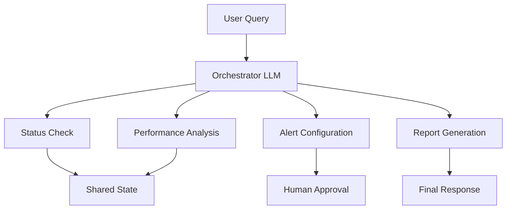

# Alpha Berkeley Framework Documentation - Getting Started Strategy

## Purpose and Vision

The Getting Started section serves as the critical conversion point where curious visitors become successful framework users. It implements a three-tier progressive learning system that respects different time commitments and skill levels while ensuring every user achieves meaningful success.

**Primary Goal**: Transform newcomers into confident framework users through progressive, hands-on learning experiences.

**Success Definition**: Users can independently build and deploy a working agent within their chosen time commitment (15 minutes to 60 minutes).

## Three-Tier Learning Architecture

### Overview of Progressive Learning System

```
Tier 1: Setup (15 min)       →  "It works on my machine"
Tier 2: Hello World (30 min) →  "I built something useful"  
Tier 3: Real Agent (60 min)  →  "I understand the patterns"
```

**Design Principles:**
- **Independent Value**: Each tier provides standalone value
- **Clear Time Contracts**: Explicit time commitments with buffer
- **Success Validation**: Concrete proof of completion at each tier
- **Natural Progression**: Each tier builds foundation for the next
- **Multiple Exit Points**: Users can stop at any tier with value gained

### Tier 1: Setup and Installation (15 minutes)

**Purpose**: Remove all technical barriers and create immediate "it works" experience

**Target Audience**: All users (100% completion rate goal)

**Learning Objectives:**
- Framework successfully installed and running
- Development environment validated
- Basic concepts introduced through working example
- Confidence established for continued learning

#### Content Structure

**Pre-Requirements Check (2 minutes):**
```markdown
## Before You Begin

✅ **Verify Your Environment**
- [ ] Python 3.11+ installed (`python --version`)
- [ ] Git available (`git --version`) 
- [ ] Code editor ready (VS Code recommended)
- [ ] 15 minutes of focused time

✅ **What You'll Have**
After this section, you'll have a working Alpha Berkeley development environment with a simple example running locally.
```

**Installation Steps (8 minutes):**
```bash
# Single command installation with verification
pip install alpha-berkeley[dev]

# Verify installation
alpha-berkeley --version
alpha-berkeley doctor  # Environment health check
```

**Quick Validation (5 minutes):**
```bash
# Create and run minimal example
alpha-berkeley init hello-world
cd hello-world
alpha-berkeley run

# Expected output: Working agent responds to test query
```

#### Success Metrics
- **Installation Success Rate**: >95% first-try success
- **Time Compliance**: 90% of users complete within 15 minutes
- **Error Recovery**: Clear troubleshooting for common issues
- **Confidence Building**: Users feel ready to continue

#### Troubleshooting Strategy
```markdown
## Common Issues and Solutions

### Installation Fails
**Symptom**: `pip install` errors
**Solution**: Use virtual environment:
```python
python -m venv alpha-berkeley-env
source alpha-berkeley-env/bin/activate  # Linux/Mac
# or alpha-berkeley-env\Scripts\activate  # Windows
pip install alpha-berkeley[dev]
```

### Verification Fails  
**Symptom**: `alpha-berkeley doctor` shows errors
**Solution**: [Specific fixes for common environment issues]
```

### Tier 2: Hello World Tutorial (30 minutes)

**Purpose**: Build complete working agent demonstrating core framework patterns

**Target Audience**: Users committed to hands-on learning (70% progression rate goal)

**Learning Objectives:**
- Understand `@capability_node` decorator pattern
- Experience convention-based auto-discovery
- See orchestrator-first execution in action
- Build confidence through immediate success

#### Content Structure

**Tutorial Introduction (3 minutes):**
```markdown
# Build Your First Weather Agent

In 30 minutes, you'll build a complete agent that:
- Responds to natural language weather queries
- Uses the framework's convention-based patterns  
- Demonstrates orchestrator-first architecture
- Runs with realistic mock data (no API keys needed)

**What you'll learn:**
- Core framework patterns
- Capability implementation
- State management basics
- Natural language processing integration
```

**Core Implementation (20 minutes):**

**Step 1: Project Structure (5 minutes)**
```bash
alpha-berkeley create weather-agent
cd weather-agent
```

Expected file structure:
```
weather-agent/
├── src/applications/weather_agent/
│   ├── __init__.py
│   ├── config.yml
│   ├── context_classes.py
│   ├── registry.py
│   └── capabilities/
│       ├── __init__.py
│       └── current_weather.py
├── requirements.txt
└── README.md
```

**Step 2: Context Class (5 minutes)**
```python
# src/applications/weather_agent/context_classes.py
from framework.context import CapabilityContext
from pydantic import Field
from datetime import datetime

class CurrentWeatherContext(CapabilityContext):
    CONTEXT_TYPE: ClassVar[str] = "CURRENT_WEATHER"
    
    location: str = Field(description="Location name")
    temperature: float = Field(description="Temperature in Celsius")
    conditions: str = Field(description="Weather conditions")
    timestamp: datetime = Field(description="Data timestamp")
```

**Step 3: Capability Implementation (10 minutes)**
```python
# src/applications/weather_agent/capabilities/current_weather.py
@capability_node
class CurrentWeatherCapability(BaseCapability):
    name = "current_weather"
    description = "Get current weather for any location"
    provides = ["CURRENT_WEATHER"]
    requires = []
    
    @staticmethod
    async def execute(state: AgentState, **kwargs) -> Dict[str, Any]:
        # Implementation with detailed comments explaining each step
        # ... [Full working implementation]
```

**Testing and Validation (7 minutes):**
```bash
# Run the agent
alpha-berkeley run

# Test queries
"What's the weather in Prague?"
"How's the weather in San Francisco?"
"Tell me about New York weather"
```

**Expected Output Validation:**
```
User: "What's the weather in Prague?"
Agent: "The weather in Prague is currently 12°C with partly cloudy conditions. 
        Data retrieved at 2024-01-15 14:30:00."
```

#### Progressive Disclosure Strategy

**Layer 1 (Basic Understanding):**
- Framework handles query parsing automatically
- Conventions reduce boilerplate code
- State management happens transparently

**Layer 2 (Pattern Recognition):**
- `@capability_node` decorator auto-discovery
- Context classes provide type safety
- Registry system manages component lifecycle

**Layer 3 (Architecture Insight):**
- Single orchestrator call vs. agent loops
- State flows through LangGraph nodes
- Convention over configuration benefits

#### Success Validation
```markdown
## ✅ Tutorial Complete!

You've successfully built a weather agent that demonstrates:
- [x] Convention-based capability registration
- [x] Type-safe context handling  
- [x] Natural language query processing
- [x] Orchestrator-first execution flow

**Next Steps:**
- 🏗️ Build a more complex agent (Tier 3)
- 📚 Explore How-To Guides for specific patterns
- 🔧 Check API Reference for advanced features
```

### Tier 3: Build Your First Real Agent (60 minutes)

**Purpose**: Create sophisticated multi-capability agent demonstrating production patterns

**Target Audience**: Developers ready for realistic complexity (40% progression rate goal)

**Learning Objectives:**
- Multi-capability coordination patterns
- Complex state management
- Error handling and resilience
- Production deployment considerations

#### Content Structure

**Agent Overview (5 minutes):**
```markdown
# Wind Turbine Monitoring Agent

Build a production-style agent that monitors wind turbine performance with:
- **4 Capabilities**: Status monitoring, analysis, alerting, reporting
- **Complex Data Flow**: Multi-step processing with state dependencies  
- **Error Handling**: Resilient patterns for production systems
- **Human-in-the-Loop**: Approval workflows for critical actions

**Real-World Context:**
This tutorial builds the same patterns used in production systems at Berkeley Lab 
for managing scientific instruments and data processing workflows.
```

**Architecture Planning (10 minutes):**


**Implementation Phases:**

**Phase 1: Core Capabilities (25 minutes)**
- Turbine status monitoring capability
- Performance analysis capability  
- Data context classes with complex relationships
- Registry configuration for multi-capability coordination

**Phase 2: Advanced Patterns (15 minutes)**
- State dependencies between capabilities
- Error handling and retry policies
- Approval workflow integration
- Performance monitoring and logging

**Phase 3: Integration and Testing (5 minutes)**
- End-to-end testing with complex scenarios
- Performance validation
- Error condition testing
- Production deployment checklist

#### Real-World Context Integration

**Production Patterns Demonstrated:**
```typescript
// Complex capability with dependencies
@capability_node
class TurbineAnalysisCapability extends BaseCapability {
  name = "turbine_analysis"
  description = "Analyze turbine performance data"
  provides = ["PERFORMANCE_ANALYSIS", "RECOMMENDATIONS"]
  requires = ["TURBINE_STATUS", "HISTORICAL_DATA"]
  
  // Error classification for production resilience
  @staticmethod
  classify_error(exc: Exception, context: dict) -> ErrorClassification {
    if isinstance(exc, DataQualityError):
      return ErrorClassification(
        severity=ErrorSeverity.RETRY,
        retry_delay=60,
        max_attempts=3
      )
    // ... [Complete error handling patterns]
  }
  
  // Production execution with monitoring
  @staticmethod
  async execute(state: AgentState, **kwargs) -> Dict[str, Any]:
    // [Full implementation with monitoring, logging, error handling]
  }
}
```

#### Success Validation and Next Steps
```markdown
## 🎉 Congratulations!

You've built a production-style agent demonstrating:
- [x] Multi-capability coordination
- [x] Complex state management
- [x] Error handling and resilience
- [x] Human-in-the-loop approval patterns
- [x] Production deployment patterns

## Your Agent Capabilities
- **Monitor**: Real-time turbine status checking
- **Analyze**: Performance trend analysis with ML insights
- **Alert**: Intelligent threshold-based alerting
- **Report**: Comprehensive performance reporting

## What You've Learned
- Production-ready architecture patterns
- Complex capability coordination
- Error resilience strategies
- Approval workflow integration
- Performance monitoring techniques

## Ready for Production?
Your agent demonstrates the same patterns used in:
- Berkeley Lab scientific instrument monitoring
- Industrial IoT system management
- Critical infrastructure oversight
```

## Cross-Tier Integration Strategy

### Consistent Terminology and Concepts

**Core Vocabulary (Introduced in Tier 1, reinforced throughout):**
- **Capability**: Reusable component that performs specific functions
- **Context**: Type-safe data structure for sharing information
- **Orchestrator**: LLM-based planning component (vs. agent loops)
- **State**: Current execution status and data
- **Registry**: Auto-discovery system for components

**Progressive Concept Building:**
```
Tier 1: "Capabilities are like functions that the agent can call"
Tier 2: "Capabilities use @capability_node decorator for auto-discovery"  
Tier 3: "Capabilities coordinate through shared state and dependencies"
```

### Code Quality and Standards

**Example Code Requirements:**
- **Completeness**: All examples run without modification
- **Type Safety**: Full TypeScript/Python type annotations
- **Error Handling**: Realistic error scenarios and recovery
- **Comments**: Explanatory comments for learning, not obvious operations
- **Style**: Consistent with framework conventions

**Testing Strategy:**
```python
# Every code example includes validation
def test_weather_capability():
    """Ensures tutorial example works as documented"""
    agent = create_agent_from_tutorial()
    response = agent.query("What's the weather in Prague?")
    assert "Prague" in response
    assert "°C" in response
    assert response_time < 2.0  # Performance validation
```

### User Experience Optimization

**Cognitive Load Management:**
- **Information Chunking**: 7±2 items per learning unit
- **Progress Indicators**: Clear completion checkmarks
- **Time Estimates**: Accurate with 20% buffer included
- **Success Validation**: Immediate feedback for each step

**Error Recovery Patterns:**
```markdown
## 🚨 Something Not Working?

### Quick Fixes
1. **Code doesn't run**: Copy-paste from GitHub repo example
2. **Import errors**: Check virtual environment activation
3. **Unexpected output**: Compare with expected results section

### Get Help Fast
- [Discord Community](link) - Real-time support
- [GitHub Issues](link) - Report bugs or unclear instructions  
- [Stack Overflow](link) - Community Q&A
```

## Analytics and Optimization

### Key Performance Indicators

**Tier 1 Metrics:**
- **Completion Rate**: Target >95%
- **Time Distribution**: 90% complete within 20 minutes
- **Drop-off Points**: Identify common failure points
- **Progression Rate**: % who continue to Tier 2

**Tier 2 Metrics:**
- **Start Rate**: % of Tier 1 completers who begin
- **Completion Rate**: Target >70%
- **Success Validation**: % who achieve working agent
- **Time Distribution**: 90% complete within 40 minutes

**Tier 3 Metrics:**
- **Start Rate**: % of Tier 2 completers who begin
- **Completion Rate**: Target >60%
- **Advanced Pattern Usage**: Tracking of advanced features used
- **Community Progression**: % who join Discord or contribute

### Continuous Improvement Process

**Weekly Reviews:**
- Tutorial completion analytics
- Common error patterns
- User feedback sentiment
- Community support load

**Monthly Optimizations:**
- Content updates based on framework changes
- Error message improvements
- Tutorial flow refinements
- Success rate optimization

**Quarterly Assessments:**
- Complete user journey analysis
- Framework evolution impact
- Competitive landscape review
- Strategic content planning

## Content Maintenance and Versioning

### Framework Evolution Synchronization

**Code Example Management:**
- Automated testing of all tutorial code
- Version-specific example repositories
- Automated updates for minor framework versions
- Major version migration guides

**Content Update Process:**
1. **Framework PR Review**: Documentation impact assessment
2. **Example Updates**: Automated testing and manual review
3. **Content Synchronization**: Tutorial updates within 48 hours
4. **Community Notification**: Clear communication of changes

### Community Contribution Integration

**Contributor Guidelines:**
- Clear standards for tutorial contributions
- Review process for community-submitted content
- Recognition system for documentation contributors
- Translation support for international community

**Quality Assurance:**
- Peer review process for all changes
- User testing of updated content
- Analytics monitoring post-updates
- Community feedback integration

This Getting Started strategy creates a comprehensive, progressive learning experience that transforms newcomers into confident Alpha Berkeley Framework users while building a foundation for advanced usage and community contribution.